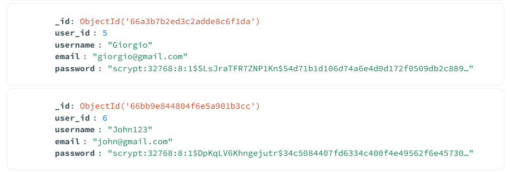
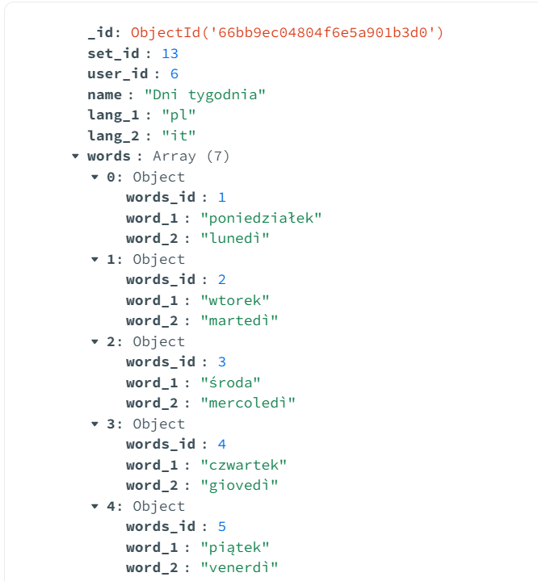

This repository is a backend part of a language learning app for Android and Windows.
  
Repository with frontend: https://github.com/jakubjachxwicz/Fishki.Maui
  
This project's part is a Rest API made in <b>Python Flask</b>. User data as well as flashcards sets are stored using <b>MongoDB</b>.
 
API contains endpoints for various CRUD operations on flashcards and users.
 
User authorization is handled with <b>JSON Web Token</b>.

Technologies used in project:
 <i>Python, Flask, MongoDB, JSON Web Token</i>

 

To repozytorium jest backendową częścią aplikacji do nauki języków na Androida oraz Windowsa.
  
Repozytorium z frontendem: https://github.com/jakubjachxwicz/Fishki.Maui
  
Ta część całego projektu to Rest API napisane w <b>Python Flask</b>. Dane o użytkownikach i zestawach fiszek są przechowywane za pomocą <b>MongoDB</b>.
 
API zawiera endpointy do wszelakich operacji CRUD na użytkownikach oraz fiszkach.
 
Autoryzacja użytkowników obsługiwana jest przy użyciu <b>JSON Web Token</b>.

Technologie wykorzystane w projekcie:
 <i>Python, Flask, MongoDB, JSON Web Token</i>

 

 
